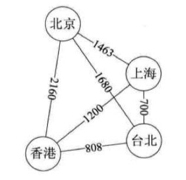

# 第七章-图

## 图的定义

图(Graph)是由顶点的有穷非空集合和顶点之间边的集合组成，通常表示为`G(V,E)`，其中，G表示一个图，V是图G中顶点的集合，E是图G中边的集合。

### 各种图定义

**无向边（Edge）** ：若顶点vi到vj之间的边没有方向，则称这条边为无向边，用无序偶对`(vi,vj)`来表示。

**无向图（Undirected graphs）** ：如果图中任意两个顶点之间的边都是无向边，则称该图为无向图。

**有向边（Arc）** ：若从顶点vi到vj的边有方向，则称这条边为有向边，也称为弧，用有序偶`<vi,vj>`来表示，vi称为弧尾（Tail），vj称为弧头（Head）。

**有向图（Directed graphs）** ：如果图中任意两个顶点之间的边都是有向边，则称该图为有向图。

**简单图** ：在图中，若不存在顶点到其自身的边，且同一条边不重复出现，则称这样的图为简单图。

**无向完全图** ：在无向图中，如果任意两个顶点之间都存在边，则称该图为无向完全图，如下图所示：


**有向完全图** ：在有向图中，如果任意两个顶点之间都存在方向互为相反的两条弧，则称该图为有向完全图，如下图所示：


**稀疏图/稠密图** ：有很少条边或弧的图称为稀疏图，反之称为稠密图，相对概念。

**权（Weight）** ：与图的边或弧相关的树，可以表示从一个顶点到另一个顶点的距离或耗费。

**网（Network）** ：带权的图通常称为网，如下图所示：



**子图（Subgraph）** ：假设有两个图 `G = (V, {E})`和`G' = (V', {E'})`，如果`V'`属于`V`且`E'`属于`E`，则称`G'`为`G`的子图。

### 图的顶点与边间关系

**顶点v的度degree** ：是和顶点v相连接的边的数目。对于有向图的顶点的度还分为出度和入度。
**邻接点** ：同一条边的两个点互为邻接点。
**路径** ：指从一个顶点到另一个顶点所经过的顶点的序列。树的路径唯一，但图的路径不唯一，所以有很多求最短路径的算法。在网络图中，路径又叫路由。
**路径的长度** ：路径上的边或弧的数目。
**回路或环** ：第一个顶点和最后一个顶点相同的路径。
**简单路径** ：路径序列中没有重复出现的顶点。
**简单回路** ：除了第一个和最后一个顶点相同外，其余的顶点都不相同。
**连通图（connected graph）** ：无向图中任意两个顶点都有路径（即都是连通的）。
**非连通图** ：存在两个顶点之间没有路径，即不连通。有n个顶点，但只有小于n-1条边，一定是非连通图。
**连通分量** ：无向图中的极大连通子图。连通图本身即是，而非连通图中最大的连通子图即是。
**强连通图** ：有向图中，任意两个顶点都存在双向连通的路径。有向图的非强连通图，对应有强连通分量。
**生成树** ：一个连通图的极小连通子图，它含有图中全部的n个顶点，但只有足以构成一棵树的n-1条边（即去掉了环路）。不过n个顶点有n-1条边并不一定是生成树，比如一个非连通图中有一部分是个环路。因此生成树的前提一定是连通图。
**有向树** ：一个有向图恰有一个顶点的入度为0（根结点），其余顶点的入度均为1。
**生成森林** ：一个有向图的所有顶点，被分成若干颗不相交的有向树，这些有向树就组成了有向森林。

## 图的抽象数据类型

```
ADT 图(Graph)
Data
  顶点的有穷非空集合和边的集合。
Operation
  CreateGraph(*G, V, VR): 按照顶点集V和边弧集VR的定义构造图G。
  DestroyGraph(*G): 图G存在则销毁。
  LocateVex(G, u): 若图G中存在顶点u，则返回图中的位置。
  GetVex(G, v): 返回图G中顶点v的值。
  PutVex(G, v, value): 将图G中顶点v赋值value。
  FirstAdjVex(G, *v): 返回顶点v的一个邻接顶点，若顶点在G中无邻接顶点返回空。
  NextAdjVex(G, v, *w): 返回顶点v相对于顶点w的下一个邻接顶点，若w是v的最后一个邻接点则返回空。
  InsertVex(*G, v): 在图G中增添新顶点v。
  DeleteVex(*G, v): 删除图G中顶点v及其相关的弧。
  InsertArc(*G, v, w): 在图G中增添弧<v, w>，若G是无向图，还需要增添对称弧<w, v>。
  DeleteArc(*G, v, w): 在图G中删除弧<v, w>，若G是无向图，则还删除对称弧<w, v>。
  DFSTraverse(G): 对图G中进行深度优先遍历，在遍历过程对每个顶点调用。
  BFSTraverse(G): 对图G中进行广度优先遍历，在遍历过程对每个顶点调用。
endADT
```

## 图的存储结构

### 邻接矩阵

**图的邻接矩阵（Adjacency Matrix）** ：存储方式是用两个数组来表示图。一个一维数组存储图中顶点信息，一个二维数组（称为邻接矩阵）存储图中的边或弧信息。

下图为无向图及其邻接矩阵存储的示意图：


- 由于不存在顶点到自身的边，所以矩阵主对角线的值均为0；
- 无向图的边都是成对存在，故无向图的边数组是一个对称矩阵，即`aij = aji`。

下图为有向图及其邻接矩阵存储的示意图：


- 顶点vi的入度是第vi列各数之和，出度是第vi行的各数之和。

网图的邻接矩阵中过保存权值，0表示`i = j`，`∞`代表不存在，如下图所示：


无向网图的邻接矩阵实现代码详见 [adjacency-matrix.c](https://github.com/logan70/Data-Structures-and-Algorithms/blob/master/%E5%A4%A7%E8%AF%9D%E6%95%B0%E6%8D%AE%E7%BB%93%E6%9E%84/%E7%AC%AC%E4%B8%83%E7%AB%A0-%E5%9B%BE/example/7.1-adjacency-matrix.c)

### 邻接表

**邻接表（Adjacency List）** ：数组与链表相结合的图的存储方法。用一个一位数组存储图中的顶点，包括顶点信息和一个指向邻接点单链表的指针，如下图所示：


无向图顶点v1关联的单链表称作顶点vi的边表，有向图顶点v1关联的单链表称作顶点vi作为弧尾的出边表。

有向图的邻接表结构是类似的，为了便于确定顶点的入度或以顶点为弧头的弧，可以建立一个有向图的逆邻接表，即对每个顶点vi都建立一个链接为v1为弧头的表，如下图所示：


对于带权值的网图，可以在边表结点定义中再增加一个weight的数据域，存储权值信息即可，如下图所示：


无图邻接表的实现代码详见 [netword-adjacency-list](https://github.com/logan70/Data-Structures-and-Algorithms/blob/master/%E5%A4%A7%E8%AF%9D%E6%95%B0%E6%8D%AE%E7%BB%93%E6%9E%84/%E7%AC%AC%E4%B8%83%E7%AB%A0-%E5%9B%BE/example/7.2-network-adjacency-list.c)

### 十字链表（Orthogonal List）

**顶点表结点结构：**

- firstin表示入边表头指针，指向该顶点的入边表中第一个结点。
- firstout表示出边表头指针，指向该顶点的出边表中的第一个结点。

**边表结点结构：**

- tailvex：弧起点在顶点表的下标
- headvex：弧终点在顶点表中的下标
- headlink：入边表指针域，指向终点相同的下一条边
- taillink：边表指针域，指向起点相同的下一条边
- weight：如果是网，则可以增加weight域来存储权值

十字链表整体如下图所示，图中虚线其实就是此图的逆邻接表的表示：


### 邻接多重表

无向图的邻接表，对于关注重点是顶点的情况比较适用，但是关注重点是边的操作的情况，则需要找到这条边的两个边表结点进行操作，比较繁琐，故优化如下：

重新定义**边表结点结构** ：

- ivex和jvex：与某条边依附的两个顶点在顶点表中的下标。
- ilink：指向依附顶点ivex的下一条边。
- jlink指向依附顶点jvex的下一条边。

这就是邻接多重表的表结构，如下图所示：


### 边集数组

**边集数组** 是由两个一维数组构成。一个是存储顶点的信息；另一个是存储边的信息，这个边数组每个数据元素由一条边的起点下标（begin）、终点下标（end）和权（weight）组成，如下图所示：

边集数组适合对边依次进行处理的操作，不适合对顶点相关的操作。


## 图的遍历

**图的遍历（Traversing Graph）** 是指从图中某一顶点触发访遍图中其余顶点，且使没每个顶点仅被访问一次的过程。

图的遍历通常有两种遍历次序方案：**深度优先遍历**和**广度优先遍历**。

### 深度优先遍历

深度优先遍历（Depth First Search），也称为深度优先搜索，简称为DFS。

从图中某个顶点v出发，访问此顶点，然后从v的未被访问的邻接点出发深度优先遍历图，直至图中所有和v有路径相通的顶点都被访问到。

> 对于非连通图，若图中尚有顶点未被访问，则另选图中一个未曾被访问的顶点作为起点，重复上述过程，直至图中所有顶点都被访问到为止。

邻接矩阵的深度优先遍历 代码实现详见 [示例程序 adjacency-matrix.c](https://github.com/logan70/Data-Structures-and-Algorithms/blob/master/%E5%A4%A7%E8%AF%9D%E6%95%B0%E6%8D%AE%E7%BB%93%E6%9E%84/%E7%AC%AC%E4%B8%83%E7%AB%A0-%E5%9B%BE/example/7.3-7.1-adjacency-matrix.c) 中的`DFSTraverse`函数。

邻接表的深度优先遍历 代码实现详见 [示例程序 network-adjacency-list.c](https://github.com/logan70/Data-Structures-and-Algorithms/blob/master/%E5%A4%A7%E8%AF%9D%E6%95%B0%E6%8D%AE%E7%BB%93%E6%9E%84/%E7%AC%AC%E4%B8%83%E7%AB%A0-%E5%9B%BE/example/7.2-network-adjacency-list.c) 中的`DFSTraverse`函数。

### 广度优先遍历

**广度优先遍历（Breadth First Search）** ，又称为广度优先搜索，简称BFS。

邻接矩阵的广度优先遍历 代码实现详见 [示例程序 adjacency-matrix.c](https://github.com/logan70/Data-Structures-and-Algorithms/blob/master/%E5%A4%A7%E8%AF%9D%E6%95%B0%E6%8D%AE%E7%BB%93%E6%9E%84/%E7%AC%AC%E4%B8%83%E7%AB%A0-%E5%9B%BE/example/7.1-adjacency-matrix.c) 中的`BFSTraverse`函数。

邻接表的广度优先遍历 代码实现详见 [示例程序 network-adjacency-list.c](https://github.com/logan70/Data-Structures-and-Algorithms/blob/master/%E5%A4%A7%E8%AF%9D%E6%95%B0%E6%8D%AE%E7%BB%93%E6%9E%84/%E7%AC%AC%E4%B8%83%E7%AB%A0-%E5%9B%BE/example/7.2-network-adjacency-list.c) 中的`BFSTraverse`函数。

## 最小生成树

**最小生成树（Minimum Cost Spanning Tree）** ：构造连通网的最小代价生成树。

### 普里姆（Prim）算法

算法描述如下：

1. 以某一个点A开始，将此点加入集合U。
2. 在所有与集合U内点连接的边中寻找权重最小的边，并且要求它的另一个点B没有被访问过。如果能找到，就将点B加入集合U。
3. 重复2的过程，直到所有的点都加入U，此时由所有边构成的树即为最小生成树。

Prim算法的代码实现详见 [示例程序 7.1-adjacency-matrix](https://github.com/logan70/Data-Structures-and-Algorithms/blob/master/%E5%A4%A7%E8%AF%9D%E6%95%B0%E6%8D%AE%E7%BB%93%E6%9E%84/%E7%AC%AC%E4%B8%83%E7%AB%A0-%E5%9B%BE/example/7.1-adjacency-matrix.c) 中的`MiniSpanTree_Prim`函数。

Prim算法的时间复杂度为`O(n^2)`。

### 克鲁斯卡尔（Kruskal）算法

算法描述如下：

1. 一个图有m个节点，n条边。我们需要把m个节点看成m个独立的生成树，并且把n条边按照从小到大的数据进行排列。
2. 在n条边中，我们依次取出其中的每一条边，如果发现边的两个节点分别位于两棵树上，那么把两棵树合并成为一棵树；如果树的两个节点位于同一棵树上，那么忽略这条边，继续运行。
3. 依次进行，直至所有顶点都在一棵树上。


Kruskal算法的代码实现详见 [示例程序 7.1-adjacency-matrix](https://github.com/logan70/Data-Structures-and-Algorithms/blob/master/%E5%A4%A7%E8%AF%9D%E6%95%B0%E6%8D%AE%E7%BB%93%E6%9E%84/%E7%AC%AC%E4%B8%83%E7%AB%A0-%E5%9B%BE/example/7.1-adjacency-matrix.c) 中的`MiniSpanTree_Kruskal`函数。